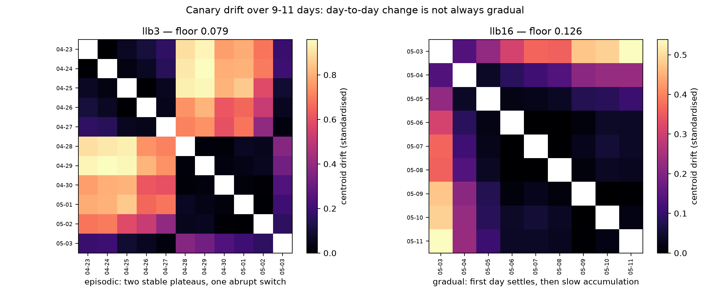

# Phase 7 — Canary, and the 11-Day Window

**Date:** 2026-08-04
**Question:** Every noise floor so far rested on ≤3-day separations. Does day-to-day variability stay constant over longer windows?
**Answer: yes for typical days — and no in a way that matters more.** Median day-to-day drift stays below the floor out to 11 days. But one of two birds reorganised its song abruptly between two consecutive days, by **8.9× its own noise floor**, then went stable again. Drift is not always gradual, and a single spontaneous event of that size is indistinguishable from a treatment effect.

Data: TweetyNet canary deposit (Cohen et al. 2022), CC0. `llb3` — 11 consecutive days,
353,371 annotated syllables, 20 syllable types. `llb16` — 9 days, 244,528 syllables,
30 types. Both 44.1 kHz.

---

## Why canary, and why it was worth the trouble

The Bengalese finch repository caps out at 3–5 days per bird, so every floor in Phases 3–5
rests on a very short baseline, and those reports say plainly that stationarity over longer
windows is untested. Canary gives 9–11 *consecutive* days — roughly triple the window — and
a second species. Canaries are also **open-ended learners**: unlike Bengalese finches they
modify song across seasons, and these recordings come from the breeding season, when that
plasticity is active. That makes them the closest natural analogue available to the
destabilisation of crystallized song this toolkit is built to detect.

Getting the data took some doing. Dryad is inaccessible without a bearer token or by
defeating a proof-of-work bot wall; Zenodo mirrors the same DOI and its files came down
through a browser. Both archives were verified byte-for-byte against Dryad's published
SHA-256 digests before use.

## Result 1: typical day-to-day drift stays below the floor, out to 11 days

| Bird | Floor (standardised) | 1-day drift, **median** | ÷ floor | 1-day, **max** | ÷ floor |
|---|---|---|---|---|---|
| `llb3` | 0.079 | 0.027 | **0.33×** | 0.710 | **8.93×** |
| `llb16` | 0.126 | 0.017 | **0.13×** | 0.138 | 1.10× |
| *Bengalese finch (Phase 3)* | 0.041 | 0.013 | 0.24× | — | — |

**On a typical day, canary song changes less than the bird's own within-day variability** —
the same conclusion Phase 3 reached in a different species, now holding across a window
three times longer. The "space timepoints ≥3 days apart" recommendation survives contact
with the longer window.

Drift does keep accumulating with separation. `llb16` grows smoothly, crossing its floor at
**~4 days** and reaching **4.3×** by day 8. So the signal window does keep opening — which
is the good news for anyone planning a multi-week experiment.

## Result 2: drift is not always gradual — and that is the finding



The two birds behave completely differently, and only the full day × day matrix shows it.

**`llb3` is episodic.** Two stable plateaus — 04-23 to 04-27, and 04-28 to 05-02 — separated
by an abrupt switch. Within either plateau, drift is 0.01–0.17. Across them it is 0.39–0.96.
The single overnight transition from 04-27 to 04-28 measures **0.710 standardised, 8.9× the
bird's own noise floor**. Then the song is stable again for five days. And 05-03 partially
reverts: it sits closer to the *first* plateau (0.03 vs 04-27) than the second (0.37 vs
04-28).

**`llb16` is gradual**, with an unreliable first day. Its 05-03 row is the outlier; from
05-04 onward almost every pair is under 0.11, with slow accumulation on top.

### This is not an artefact — three checks

| Hypothesis | Test | Result |
|---|---|---|
| Artefact of the PCA reference day | Refit the space on four different days | **Ruled out.** Across/within-plateau ratio is 16.0×, 16.4×, 17.1×, 16.9× — unchanged |
| Time-of-day confound | Per-day recording hours | **Ruled out.** Every day spans ~5.7–18.3 h with similar medians |
| Recording-volume artefact | Bouts per day | **Ruled out.** 04-27 has 245 bouts, 04-28 has 364; both large, the boundary sits between them |

## What this changes for an experiment

**A spontaneous reorganisation looks exactly like a treatment effect.** If `llb3` had been
a treated bird sampled at day 0 and day 10, the measured drift would have been ~0.8
standardised — 10× its floor, wildly "significant" — and caused by nothing the experimenter
did. Conversely, sampling 04-23 versus 04-27 would have found nothing at all. **In an
open-ended learner, timepoint choice alone can produce or erase a large effect.**

Three concrete consequences, now in the protocol:

1. **Report the median, not the mean.** `llb3`'s *mean* 1-day drift is 0.104 — above its
   floor, implying the bird changes measurably every single day. Its *median* is 0.027,
   well below. The mean is carried entirely by one transition pair out of ten. Mean drift
   across day-separations is the wrong summary whenever change is episodic.
2. **Always look at the full day × day matrix.** A drift-versus-separation curve averages
   across the block structure and hides it. `llb3`'s curve peaks at 5 days and then
   *declines* — an artefact of which pairs straddle the transition, not a property of the
   bird.
3. **Collect enough baseline days to see the bird's own transition rate.** One transition in
   11 days for `llb3` means a two-timepoint design has a material chance of straddling a
   spontaneous event. The baseline has to be long enough to estimate how often that happens.

**First recording days remain unreliable.** `llb16`'s first day is its clear outlier, as was
`gy6or6`'s in Phase 3 and, more weakly, `llb3`'s partial first day. That is now three birds
across two species and two independent datasets. Habituation to the recording chamber is the
obvious explanation. Quarantine the first day.

## Two defects this run exposed in the toolkit

**A sample-rate bug, now fixed.** The spectrogram hard-coded 32 kHz when computing its
output width, so at 44.1 kHz `max_duration_s = 0.2` silently kept only the first **145 ms**
of every syllable and the STFT window spanned a different physical duration. All the canary
data is 44.1 kHz, and the Duke developmental deposit mixes 44.1 and 32 kHz *within one
dataset*. Window and hop are now specified at a reference rate and scaled to the actual one,
so a row means the same frequency band and a column the same millisecond on any rig. The
32 kHz results are unaffected (scale factor 1.0). The first test written for this did not
catch the bug — a truncated syllable still fills every column, it just represents less time
— so the test now marks the final 20 ms with a distinct frequency and checks that mark
survives.

**A degenerate-resample crash, now fixed.** With a syllable type present in few bouts, a
bootstrap resample can draw the same bout every time; the bout-level estimator needs two
distinct bouts to form a variance. The guard counted renditions rather than distinct bouts.
Hit for real on `llb16`, which has 30 syllable types. Rare syllables should cost precision,
not crash the analysis.

**And three annotation defects in the published data**, repaired and counted rather than
crashed on: 24 syllables in `llb3` begin at a negative time (down to −9.5 ms), one has an
offset at or before its onset, and offsets running past the end of the recording occur in
roughly a tenth of files.

## Limitations

- **Two birds.** `llb3` is episodic, `llb16` is gradual. Which is typical is unknown, and
  n=2 cannot say.
- **Both are canaries in breeding season** — open-ended learners at their most plastic.
  Whether a closed-ended species shows episodic reorganisation at all is untested; the
  Bengalese finch window is too short to have detected one.
- **11 days is still not weeks.** The stationarity question is answered for ~10 days, not
  for the multi-week timescale a manipulation experiment might use.
- `llb11` (6.5 GB, 11 more days) was not downloaded; it would make a third bird.

## Reproducing

```bash
# archives from the Zenodo mirror of doi:10.5061/dryad.xgxd254f4 (CC0), then:
python scripts/canary_noise_floor.py --root data/canary/llb3 --bird llb3 \
    --out results/phase7/canary_llb3.json
```

Tests: `python -m pytest tests/ -q`.
