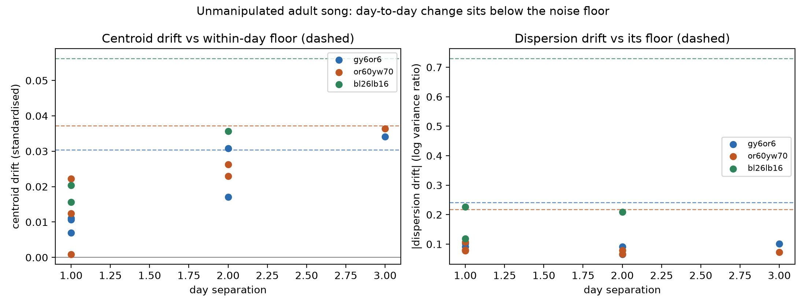
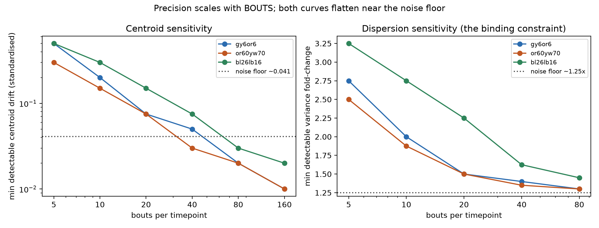
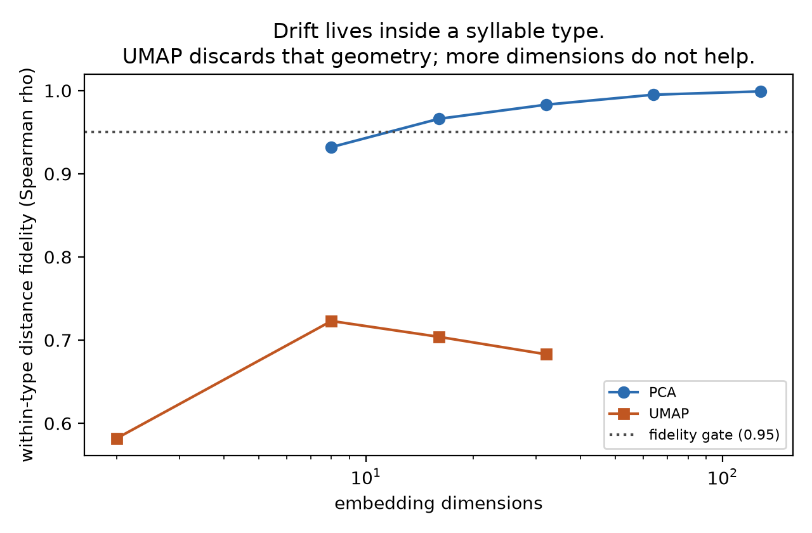

# Songbird Vocal Plasticity Measurement Toolkit

Measures how much an individual songbird's crystallized song drifts over time, **with a
noise floor measured from that bird's own baseline** — so a change can be called real, or
not, on evidence rather than on a point estimate.

Built for planning and analysing experiments that ask whether an experimental
manipulation alters crystallized adult song. Birdsong is treated as what it is: a learned
motor sequence with a syllable inventory and probabilistic syntax. Not language.

**Start here:** [PROTOCOL.md](PROTOCOL.md) — the experimental protocol, in the order a lab
does things.

---

## Install

Requires Python ≥3.12 and [`uv`](https://docs.astral.sh/uv/).

```bash
uv venv --python 3.12 .venv
uv pip install -e .
```

Optional extras, neither needed for the analysis itself:

```bash
uv pip install -e ".[segment]"   # vak + TweetyNet, to produce annotations (pulls torch)
uv pip install -e ".[validate]"  # h5py, for the developmental validation scripts
```

Verified from scratch: a clean 3.12 environment installs in ~235 MB and passes all 259
tests.

Check it works, and see the whole workflow in about a minute:

```bash
python examples/quickstart.py
```

That simulates a small two-group experiment with a known injected effect, runs the full
pipeline, and reports whether it recovered the effect.

## Use

```bash
# 1. Describe where the recordings are (or write the manifest CSV yourself)
songbird manifest --root recordings/ --out manifest.csv \
    --pattern '(?P<bird>\w+)_(?P<timestamp>\d{8}T\d{4})\.wav$' \
    --timestamp-format '%Y%m%dT%H%M'

# 2. Drift and noise floors, per bird
songbird analyse --manifest manifest.csv --out results.json --drift-out drift.csv

# 3. Treated versus control
songbird compare --drift drift.csv --out comparison.json --alternative greater

# 4. Before running anything: how many birds do you need?
songbird plan --effect 0.20 --between-bird-sd 0.05
```

Annotations can be in any format [`crowsetta`](https://crowsetta.readthedocs.io) reads:
`simple-seq` (3-column CSV), `notmat` (evsonganaly), `raven`, `textgrid` (Praat),
`aud-seq` (Audacity), and others.

## What it measures

Song can change in three ways, and they are largely independent — so all three are
reported, each against its own noise floor.

| Metric | Question | Adult noise floor (measured) |
|---|---|---|
| **Centroid drift** | did the syllable *move*? | ~0.041 standardised |
| **Dispersion drift** | did it get *sloppier*? | ~1.24–2.07× variance |
| **Syntax drift** | did the *order* change? | bird-specific, and **never zero** |

"No effect" is only interpretable if all three were measured.

## The headline results



**In unmanipulated adult song, day-to-day drift sits below the within-day noise floor.**
At 1-day separation, centroid drift averages 0.013 against a floor of 0.041, with 0 of 26
syllable types exceeding it across three birds. Drift grows ~0.012/day and clears the floor
at **≈3 days** — that is where the usable signal window opens.



**Record ~80 bouts (~8 min of song) per bird per timepoint.** Sensitivity improves as 1/N
with the number of *bouts* — not minutes, not syllables. Below 80 bouts sensitivity falls
away quickly; above it, precision is already finer than the bird's own variability, so
extra recording cannot strengthen a claim. Past that point, power has to come from more
birds or longer separations.



**Drift is measured in PCA space, never UMAP.** Every representation tested recovered human
syllable labels at ~99%, so label recovery could not choose between them. The deciding test
was whether distances *within* a syllable type still track acoustic differences — because
that is where drift lives. PCA scores ρ = 0.996; UMAP scores 0.45–0.66, and more dimensions
do not help. A drift metric computed in UMAP space would have been badly attenuated with no
warning sign.

## Validation

**Deafening — an adult manipulation, the target condition.** 19 of 19 deafened adult zebra
finches drift past their own within-day noise floor, at a **median 122× that floor**, with a
median **4 days** before the effect first becomes visible (paired within-bird, p = 0.0001).
Target-syllable pitch moved 3–11%, or 2.7–7.2 baseline SDs. Each bird's floor came from its
own pre-deafening days, so nothing was borrowed across animals.
See [VALIDATION_DEAFENING.md](VALIDATION_DEAFENING.md).

**Development — a second, independent effect.** With the dataset authors' own syllable
labels (readable since Aug 2026), **per-type convergence toward crystallized song
replicates in 5 of 5 juvenile zebra finches** at 2–24× the pre-reference distance, and the
consecutive-day comparison still finds nothing — the fixed-baseline design is what detects
development. An earlier claim that juvenile song is ~1.4× more variable within syllable
type, made with cluster-derived labels, only partially survived relabelling: 2 of 5 birds,
one marginal, and the second bird originally cited was an artefact and is retracted.
Details and correction in [VALIDATION_AUTHOR_LABELS.md](VALIDATION_AUTHOR_LABELS.md).

Worth knowing *how* that went. The consecutive-day framing **failed** this test outright
(ratio 1.0×, no effect at all). Two things rescued it, and both became recommendations:

- compare each timepoint against a **pooled baseline**, not the preceding timepoint;
- measure **dispersion**, not only centroid movement.

## Drift is not always gradual


Over an 11-day window, one canary sang two stable song states separated by a **single
abrupt overnight switch measuring 8.9× its own noise floor** — then held stable for five
more days. Nothing was done to that bird. A treated animal sampled at day 0 and day 10
would have shown a wildly "significant" effect caused by nothing the experimenter did;
sampled at day 0 and day 4, nothing at all.

Typical (median) day-to-day drift still sits below the floor out to 11 days, in both
canaries and in the Bengalese finches — so the ≥3-day guidance holds. But the mean does
not: for that bird the mean 1-day drift reads *above* floor, carried entirely by the one
transition night. **Report the median and plot the full day × day matrix.**
See [PHASE7_CANARY_REPORT.md](PHASE7_CANARY_REPORT.md).

## Findings that changed the design

Six results came from a guardrail catching something rather than from the planned analysis.
Each is in [DECISION_LOG.md](DECISION_LOG.md) with its evidence.

1. **The naive drift metric manufactures drift.** Syllables arrive in correlated bouts;
   treating them as independent under-corrects the sampling bias ~10×, giving a mean of
   +1.41 where the truth is 0 — and it never goes negative, so it never looks like noise.
   It is also worst on the quietest days. **The bout is the sampling unit everywhere.**
2. **UMAP fails the fidelity gate** while passing every conventional check.
3. **Two of five "baseline" days in a curated public dataset were not baseline** — 7.6–8.0×
   the drift of any sibling pair, after ruling out three alternative explanations.
4. **A fixed quality threshold reversed a result's sign.** Selecting sounds within a fixed
   distance of a syllable mode kept 12% of them early in development and 70% late, making
   juvenile song look *less* variable than adult. Match the selection *fraction*, and sweep it.
5. **Silhouette score is anti-correlated with what matters here** and is barred from
   embedding selection.
6. **Published data had two undocumented defects** — a filename date reversed relative to
   its own directory, and a 16-bit file counter that wrapped negative mid-day.

## Layout

```
songbird/          the library
  ingest/          manifest + dataset loaders -> canonical syllable table
  features/        fixed-size syllable spectrograms
  drift/           centroid, dispersion, syntax; bootstrap and split-half nulls
  metrics/         segmentation, labelling, embedding fidelity
  pipeline.py      end-to-end analysis
  group.py         treated vs control; birds-needed
  power.py         sensitivity by injection into real data
  plots.py         figures that always draw the floor
scripts/           the analysis behind each phase report, rerunnable
examples/          worked end-to-end example
tests/             each written before its implementation
```

## Reports

[Protocol](PROTOCOL.md) · [Phase 0 — data audit](PHASE0_DATA_AUDIT.md) ·
[Phase 1 — ingestion & segmentation](PHASE1_REPORT.md) ·
[Phase 2 — embedding fidelity gate](PHASE2_REPORT.md) ·
[Phase 3 — drift & noise floor](PHASE3_REPORT.md) ·
[Phase 4 — sensitivity](PHASE4_REPORT.md) ·
[Phase 5 — dispersion](PHASE5_DISPERSION_REPORT.md) ·
[Phase 7 — canary, 11-day window](PHASE7_CANARY_REPORT.md) ·
[Validation: deafening](VALIDATION_DEAFENING.md) ·
[Validation: development](VALIDATION_REPORT.md) ·
[Re-analysis with author labels](VALIDATION_AUTHOR_LABELS.md) ·
[Decision log](DECISION_LOG.md)

## Known limits

- Floors were measured over ≤3-day separations in three Bengalese finches and out to 11 days
  in two canaries. Beyond ~10 days stationarity is **untested** — measure your own baseline
  on the timescale you plan to use.
- Validated against **deafening** (19 adult birds) and **development** (2 juveniles), not
  against every kind of manipulation a lab might apply. Deafening works by removing
  auditory feedback; a manipulation acting through another route would not. Both
  destabilise crystallized song, which is what makes deafening a good available proxy, but
  they are not interchangeable — check that the effect you expect is one this metric can
  see.
- The deafening test used the authors' derived **pitch** measurements, so it validates the
  drift *statistic* on adult song, not this toolkit's own audio→embedding path (that is
  validated separately on Bengalese finch and zebra finch development).
- Syntax is first-order (adjacent pairs). Longer-range sequence structure is not covered.
- Dispersion uses total variance; a change in the *shape* of the rendition cloud that
  preserved its trace would be missed.
- Training a segmenter is CPU-only on Apple Silicon: `vak` rejects `mps`, and routing via
  `gpu` fails because its spectrograms are float64.

## Data

| Role | Dataset | Scale |
|---|---|---|
| Adult null | [Bengalese Finch Song Repository](https://doi.org/10.6084/m9.figshare.4805749) | 4 birds, 18 bird-days |
| Adult null, long window | [TweetyNet canary](https://doi.org/10.5061/dryad.xgxd254f4) | 2 birds analysed, 20 bird-days, 598k syllables |
| Validation | [Duke juvenile zebra finch](https://doi.org/10.7924/r4j38x43h) | 183 bird-days, 163 h |
| Validation, adult manipulation | [Zai et al. deafening](https://doi.org/10.3929/ethz-b-000670443) | 19 birds analysed of 82 |

The widely-used Koumura BirdsongRecognition dataset has **no recoverable time axis** and
cannot support drift analysis, despite being the most-cited annotated Bengalese finch
corpus. Details in [Phase 0](PHASE0_DATA_AUDIT.md).
